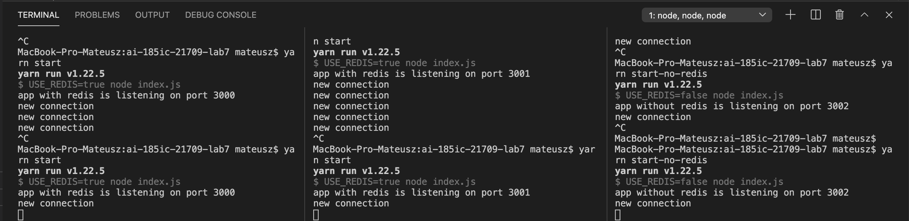
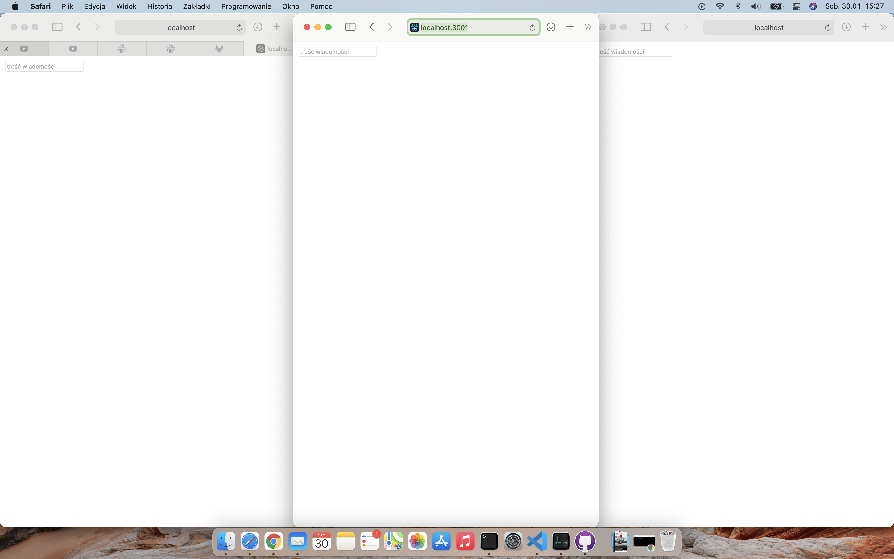
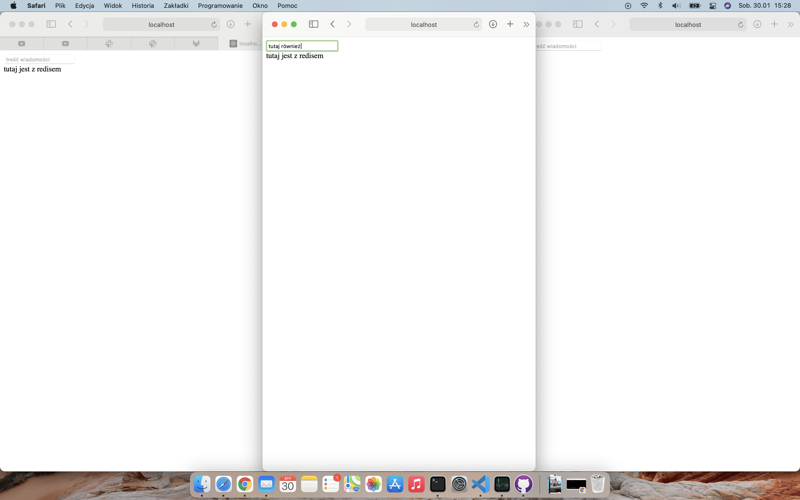
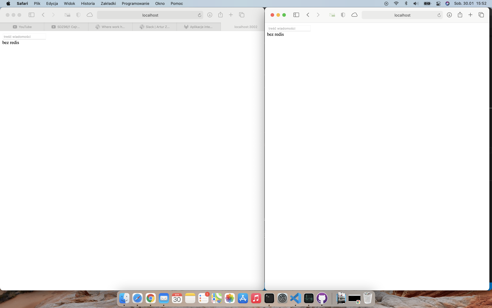

# ai-185ic-21709-lab7

## teoria
Zadanie polega na skorzystaniu z redisa w dowolnym celu. W tym przykładzie stworzyłem prosty czat, informacje o połączeniu użytkowników mogą być przechowywane jedynie lokalnie (w obrębie instancji serwera) lub synchronizowane przez redis. W pierwszym przypadku, instancje nie są w stanie wysyłać wiadomości do klientów połączonych z inną instancją. W drugim przypadku - wszystkie instancje są w stanie wysyłać wiadomości do wszystkich klientów. Zastosowania: można np stworzyć serwer aplikacji działający wielowątkowo - w celu zwiększenia wydajności, jednocześnie umożliwiając komunikację klientów połączonych do różnych wątków. Innym przykładem może być np.: wiele różnych - niezależnych od siebie aplikacji, które posiadają jednak pewien wspólny komponent, lub korzystają z jakiegoś wspólnego źródła danych.  

## ten przykład
Wspomniany czat jest możliwie najprostszy - trywialny - ponieważ celem jest jedynie ukazanie działania redis, sam czat jest implementowany w kolejnym zadaniu. Serwer uruchomiony jest w skaner portów i uruchamia się na pierwszym dostępnym porcie z zakresu 3000-3999. Serwer zintegrowany z redis uruchamia się skryptem "start", natomiast bez wspomnianej integracji poleceniem "start-no-redis".

Opisy wszystkich zdjęć znajdują się w ich tytułach (należy najechać myszą)

 - wysyłane wiadomości widoczne są przez wszystkich klientów połączonych z tym samym serwerem i tylko przez nich.")

